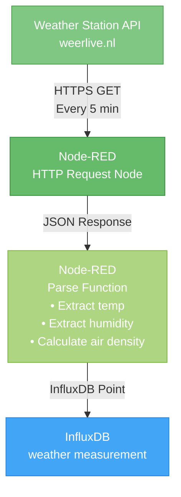
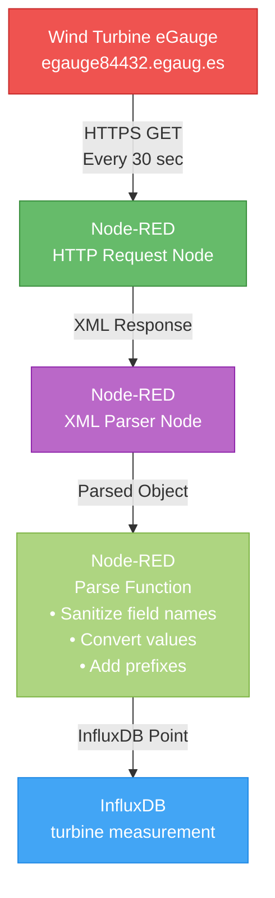
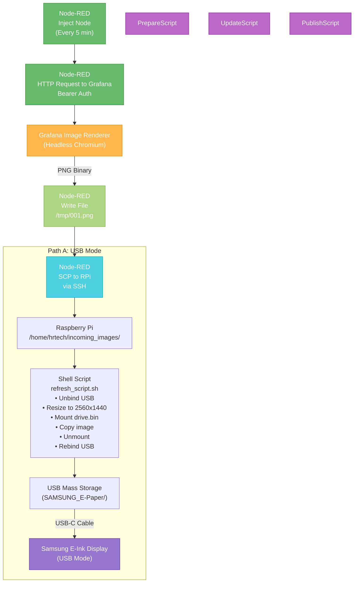

# Data Flow

This document details how data moves through the system from sensors to display.

## Flow 1: Weather Data Collection



### Weather Data Fields Stored

| Field | Description | Unit |
|-------|-------------|------|
| temperature_C | Air temperature | °C |
| humidity | Relative humidity | % |
| wind_speed_kmh | Wind speed | km/h |
| wind_speed_ms | Wind speed | m/s |
| wind_speed_kn | Wind speed | knots |
| wind_bft | Beaufort scale | - |
| wind_direction | Cardinal direction | text |
| wind_direction_deg | Wind direction | degrees |
| air_pressure_hPa | Atmospheric pressure | hPa |
| dew_point_C | Dew point | °C |
| air_density | Calculated air density | kg/m³ |
| visibility_m | Visibility | meters |
| summary | Weather description | text |

### Air Density Calculation

```javascript
let P = weather.luchtd * 100;  // hPa → Pa
let R = 287;                    // J/(kg·K)
let T_K = T + 273.15;           // °C → K
let air_density = P / (R * T_K);
```

## Flow 2: Turbine Data Collection



### Field Name Sanitization

The parse function converts eGauge field names to snake_case and adds prefixes:

| Original Prefix | New Prefix | Example |
|----------------|------------|---------|
| S6_, S5_, S2_ | grid_ | `S6_Power` → `grid_s6_power` |
| IM_ | orientation_ | `IM_X` → `orientation_x` |
| VM_ | vibration_ | `VM_Accel` → `vibration_accel` |

## Flow 3: Image Rendering & Delivery



## Timing & Frequencies

| Activity | Frequency | Node-RED Node |
|----------|-----------|---------------|
| Weather data poll | Every 5 minutes (300s) | loop_weather_data |
| Turbine data poll | Every 30 seconds | loop_turbine_data |
| Image render & delivery | Every 5 minutes (300s) | loop_image_renderer |

## Authentication & Tokens

### Grafana to Image Renderer
- **Method**: Bearer token authentication
- **Token**: `glsa_AzyNQ7uhzHzg4UCe5KC8fHUAiJPGjBaz_0d0c9ffb`
- **Environment Variables**:
    - Grafana: `GF_RENDERING_RENDERER_TOKEN`
    - Renderer: `AUTH_TOKEN`

!!! warning "Security Note"
    Tokens shown here are examples from your development environment. In production, regenerate and secure these tokens.

### Node-RED to Raspberry Pi
- **Method**: SSH with key-based authentication
- **Network**: Tailscale VPN (encrypted mesh network)
- **Command**: `scp /tmp/001.png <pi-user>@<pi-tailscale-ip>:/home/<pi-user>/incoming_images/incoming.png`
  - Example: `scp /tmp/001.png hrtech@100.64.1.5:/home/hrtech/incoming_images/incoming.png`
  - Uses Tailscale IP (typically `100.x.x.x` range)

## Error Handling

### Node-RED Flow Logic
- Each loop operates independently
- Failed HTTP requests logged to debug nodes
- Continue on error to prevent blocking other flows

### Raspberry Pi Scripts
- `set -e` in scripts: Exit on any error
- Check if USB gadget is bound before updating
- Verify mount points exist before operations

## Data Retention

- **InfluxDB**: Default retention policy (check IOTstack settings)
- **Grafana**: Dashboard configured for last 3 hours (`from=now-3h&to=now`)
- **Images**: Only latest image kept on Raspberry Pi and display
