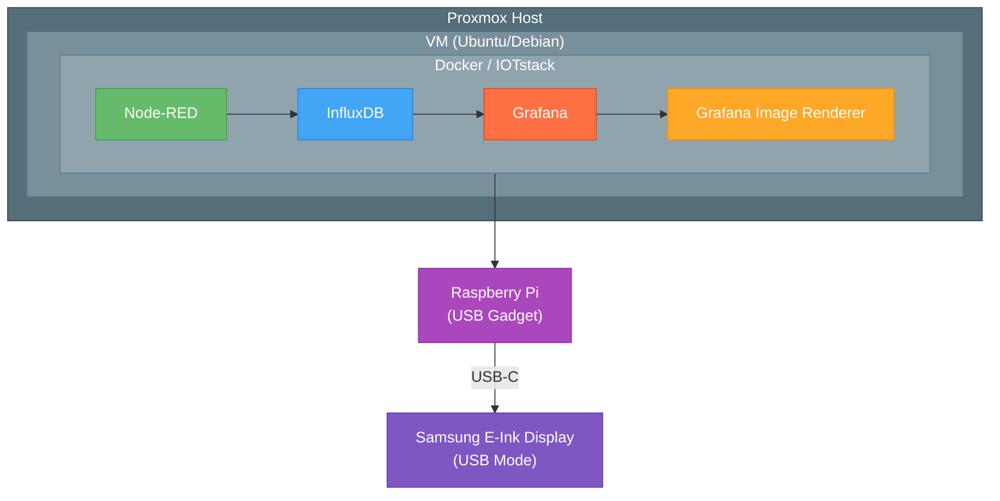
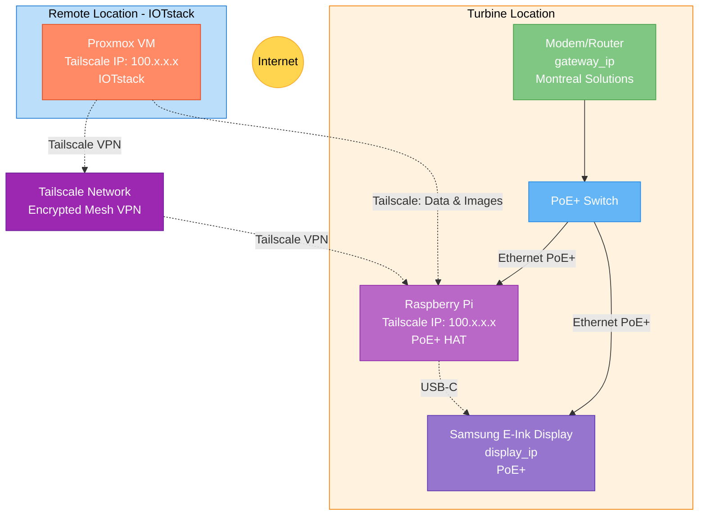

# System Overview

## Architecture Diagram

## Component Roles

### Proxmox Host
- **Purpose**: Virtualization platform
- **Function**: Hosts the VM running the entire IoT stack
- **Benefits**: Easy backup, snapshots, resource management

### Virtual Machine
- **OS**: Linux (Ubuntu/Debian recommended by IOTstack)
- **Purpose**: Runs Docker and all services
- **Resources**: CPU, RAM, storage allocated from Proxmox

### IOTstack Services

#### Node-RED
- **Role**: Orchestration and automation engine
- **Functions**:
    - Polls weather API every 5 minutes
    - Polls eGauge (turbine sensors) every 30 seconds
    - Requests dashboard images every 5 minutes
    - Manages image delivery to Raspberry Pi via SCP

#### InfluxDB 1.0
- **Role**: Time-series database
- **Functions**:
    - Stores weather data (temperature, humidity, wind, pressure)
    - Stores turbine sensor data (power, vibration, orientation)
    - Optimized for time-based queries

#### Grafana
- **Role**: Visualization and dashboard platform
- **Functions**:
    - Displays real-time turbine and weather data
    - Configured with custom renderer integration
    - Serves dashboard to image renderer

#### Grafana Image Renderer
- **Role**: Headless browser for dashboard screenshots
- **Functions**:
    - Renders Grafana dashboards as PNG images
    - Runs outside IOTstack but in Docker
    - Authenticated via bearer token

#### Portainer
- **Role**: Docker management UI
- **Functions**:
    - Monitor container status
    - View logs
    - Manage stack updates

### Raspberry Pi
- **Role**: USB mass storage bridge
- **Mode**: USB gadget mode (mass storage)
- **Functions**:
    - Receives images via SCP from Node-RED
    - Processes and formats images for e-ink display
    - Exposes images via USB mass storage to display
- **Scripts**: Automated image handling and refresh

### Samsung EM32DX E-Ink Display
- **Technology**: 32" E-Paper display
- **Power**: PoE+
- **Display Mode**: USB mass storage - reads images from Raspberry Pi

## Network Topology

## Data Sources

### Weather Station API
- **URL**: `https://weerlive.nl/api/weerlive_api_v2.php`
- **Location**: 51.89908, 4.42348
- **Data**: Temperature, humidity, wind speed/direction, air pressure, visibility
- **Frequency**: Every 5 minutes

### eGauge (Turbine Sensors)
- **URL**: `https://egauge84432.egaug.es/cgi-bin/egauge?inst`
- **Format**: XML
- **Data**: Power output, vibration sensors, orientation sensors
- **Frequency**: Every 30 seconds

## Image Delivery Flow

1. Node-RED triggers image request (every 5 minutes)
2. Grafana Image Renderer renders dashboard at 1536px width
3. Image returned as binary data to Node-RED
4. Node-RED writes to `/tmp/001.png`
5. Node-RED transfers image via SCP to Raspberry Pi through Tailscale VPN
6. Raspberry Pi shell scripts process the image
7. Image is exposed via USB mass storage to the display
8. Display refreshes and shows the new image

## Network Security

### Tailscale VPN

All communication between the Proxmox VM and Raspberry Pi happens through Tailscale's encrypted mesh network:

- **Zero-config mesh VPN** - Tailscale automatically creates secure peer-to-peer connections
- **No port forwarding required** - Works through NATs and firewalls without manual configuration
- **WireGuard-based encryption** - Uses the WireGuard protocol under the hood for secure tunneling
- **Automatic IP assignment** - Each device gets a persistent Tailscale IP (100.x.x.x range)
- **SSH never exposed publicly** - SSH port 22 remains closed to the internet, accessible only via Tailscale
- **Easy multi-device management** - Simple web-based admin panel for device management

**Setup**: Both the VM and Raspberry Pi run the Tailscale client and authenticate to your Tailscale network (tailnet). Once connected, they can communicate directly using their assigned Tailscale IPs (e.g., VM at `100.64.1.10`, Pi at `100.64.1.5`).

**Network Flow**: `Node-RED → Tailscale VPN → Raspberry Pi`

See [Node-RED Tailscale Configuration](../services/node-red.md#tailscale-configuration) for setup details.

## Key Design Decisions

- **Why InfluxDB 1.0?**: IOTstack default, simpler than 2.0 for this use case
- **Why separate image renderer?**: Not included in IOTstack by default, requires custom token auth
- **Why Raspberry Pi bridge?**: Samsung display USB mode requires specific file structure
- **Why dual display modes?**: Redundancy and flexibility for the end user
