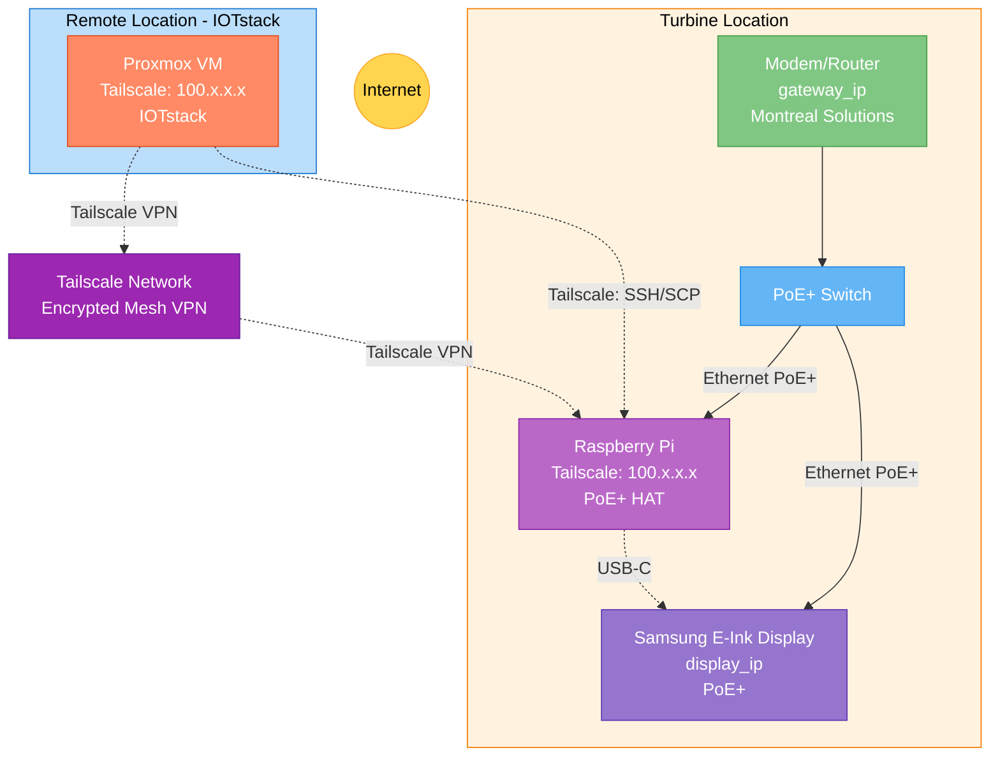

# Network Topology

This document describes the physical and logical network setup.

## Network Diagram



## IP Addresses

### Remote Location (Proxmox Host)

| Device | IP Address | Connection | Notes |
| ------ | ---------- | ---------- | ----- |
| Internet Modem | `<remote_gateway_ip>` | - | Gateway at Proxmox location |
| Proxmox VM (IOTstack) | `<vm_ip>` (e.g., 192.168.x.164) | Ethernet to modem | Static IP recommended |

### Local Location (Display Site)

| Device | IP Address | Connection | Notes |
| ------ | ---------- | ---------- | ----- |
| Internet Modem | `<local_gateway_ip>` (default: .1) | - | Montreal Solutions, DHCP server |
| Raspberry Pi | `<rpi_ip>` (e.g., 192.168.178.148) | PoE+ to switch | Static IP required |
| Samsung E-Ink Display | `<display_ip>` | PoE+ to switch | Check display settings |
| PoE+ Switch | `<switch_ip>` | Ethernet to modem | May have management IP |

## Network Segments

### Remote Location (Proxmox Host)

Proxmox VM on its own network segment:

- Gateway: `<remote_gateway_ip>`
- Subnet: Varies by location
- DNS: Provided by ISP or custom

### Local Location (Display Site)

Raspberry Pi and Display on `192.168.178.0/24` network:

- Gateway: `192.168.178.1` (Montreal Solutions modem)
- Subnet Mask: `255.255.255.0`
- DNS: Provided by modem (or 8.8.8.8)

!!! info "Remote Communication via Tailscale VPN"
    The Proxmox VM communicates with the Raspberry Pi over the internet via Tailscale's encrypted mesh network:
    
    - **Zero-config mesh VPN** - Both devices connect to your Tailscale network (tailnet)
    - **VM Tailscale IP**: e.g., `100.64.1.10` - Persistent IP assigned by Tailscale
    - **Raspberry Pi Tailscale IP**: e.g., `100.64.1.5` - Persistent IP assigned by Tailscale
    - **No port forwarding required** - Tailscale handles NAT traversal automatically
    
    All SSH/SCP traffic is encrypted through Tailscale's WireGuard-based tunnel. SSH port 22 is never exposed publicly - only accessible through the Tailscale network. Both devices initiate outbound connections to Tailscale's coordination server, so **no inbound ports or firewall rules are needed on either side**.
    
    See [Node-RED Tailscale Configuration](../services/node-red.md#tailscale-configuration) for setup details.

## Connection Details

### Proxmox Host / VM

- **Location**: Remote location (separate from display site)
- **Connection**: Ethernet to local network
- **Network Mode**: Bridged (vmbr0 in Proxmox) or NAT
- **IP Configuration**: DHCP or static
- **VPN**: Tailscale client (Docker or native)
- **Required Ports**: None (only outbound HTTPS to Tailscale servers)
- **Services** (internal access only):
  - 3000 (Grafana)
  - 8086 (InfluxDB)
  - 1880 (Node-RED)
  - 9000 (Portainer)
  - 8081 (Grafana Image Renderer)

### Raspberry Pi

- **Location**: Local location (at display site)
- **Connection**: PoE+ HAT to PoE+ switch
- **Power**: Supplied via PoE (48V DC, stepped down)
- **IP Configuration**: Static (local network), Tailscale IP assigned automatically
- **Tailscale Client**: Running on Pi for VM communication
- **Remote Access**: Via Tailscale VPN from VM
- **USB Connection**: USB-C to display (data + mass storage)
- **Required Ports**: None (Tailscale handles connectivity)
- **Services**:
  - 22/TCP - SSH (only accessible via Tailscale, not publicly exposed)

### Samsung E-Ink Display

- **Location**: Local location (at display site)
- **Connection**: PoE+ to switch
- **Power**: PoE+ (802.3at, up to 25W)
- **IP Configuration**: DHCP or static
- **USB Connection**: USB-C to Raspberry Pi
- **Display Mode**: USB Mass Storage (reads images from Pi via USB)

## PoE+ Switch

### Requirements

- **Standard**: 802.3at (PoE+)
- **Power Budget**: Minimum 30W per port
  - Display: ~20-25W
  - Raspberry Pi: ~5-8W (with HAT)

### Ports Used

- **Port 1**: To modem (uplink)
- **Port 2**: To Raspberry Pi (PoE+)
- **Port 3**: To Samsung Display (PoE+)
- Additional ports available for expansion

## Modem Configuration

### Local Modem (Display Site)

Managed by **Montreal Solutions**. Configuration required:

- **No port forwarding required** - Tailscale handles all VPN connectivity automatically
- **Static IP or DHCP reservation** for Raspberry Pi (recommended for easier management)
- **No firewall changes needed** - Pi only makes outbound connections to Tailscale servers
- **Optional**: DHCP reservation for Display
- **Optional**: WiFi configuration

!!! success "Tailscale Advantage"
    Tailscale eliminates the need to configure port forwarding, firewall rules, or involve network administrators. Both the VM and Raspberry Pi make outbound HTTPS connections to Tailscale's coordination servers, so no inbound ports need to be opened on either network.

### VM Network (Proxmox Location)

Configuration at VM location:

- **No port forwarding required** - VM only makes outbound connections
- **No firewall changes needed** - Outbound HTTPS traffic typically allowed
- **VM network configuration**: Managed by network admin or Proxmox host
- **Advantage**: No need to involve network admin for VPN setup

## Static IP Configuration

### On Proxmox VM

See [VM Configuration](../infrastructure/vm-setup.md#set-static-ip-recommended).

### On Raspberry Pi

Edit `/etc/dhcpcd.conf`:

```bash
sudo nano /etc/dhcpcd.conf
```

Add at the end:

```
interface eth0
static ip_address=<rpi_ip>/24
static routers=<gateway_ip>
static domain_name_servers=8.8.8.8 8.8.4.4
```

Restart:

```bash
sudo reboot
```

### On Samsung Display

Access display network settings:

1. Open Samsung Epaper app
2. Select the configured screen
3. Navigate to Network
4. Set static IP or use DHCP reservation on modem

## Firewall Considerations

### Proxmox Host

If firewall enabled, allow:

- Inbound: SSH (22), Web UI (8006)
- Outbound: All

### VM (IOTstack)

Allow inbound from LAN:

- 3000, 8086, 1880, 9000, 8081

Example UFW rules:

```bash
sudo ufw allow from 192.168.178.0/24 to any port 3000
sudo ufw allow from 192.168.178.0/24 to any port 8086
sudo ufw allow from 192.168.178.0/24 to any port 1880
sudo ufw enable
```

### Raspberry Pi

Allow SSH only from Tailscale network:

```bash
# Allow SSH only through Tailscale interface
sudo ufw allow in on tailscale0 to any port 22

# Deny SSH from everywhere else
sudo ufw deny 22/tcp

# Enable firewall
sudo ufw enable
```

This configuration allows SSH only through the Tailscale interface, not from the public internet or local network.

## DNS Configuration

### Internal DNS

No internal DNS server. Devices use modem as DNS or public DNS:

- `8.8.8.8` (Google)
- `8.8.4.4` (Google)
- `1.1.1.1` (Cloudflare)

### Docker Internal DNS

Docker containers use internal DNS:

- Grafana reaches InfluxDB via hostname `influxdb`
- Node-RED reaches InfluxDB via hostname `influxdb`

## Network Testing

### Connectivity Tests

From VM to Pi (via Tailscale VPN):

```bash
# Verify Tailscale is connected
tailscale status  # or: docker exec tailscale tailscale status

# Test Tailscale connectivity
ping <pi_tailscale_ip>  # e.g., ping 100.64.1.5

# SSH through Tailscale
ssh <pi_username>@<pi_tailscale_ip>  # e.g., ssh hrtech@100.64.1.5
```

From Pi to internet:

```bash
ping 8.8.8.8
```

From Pi to Display (local network):

```bash
ping <display_ip>
```

### Service Tests

Test Grafana from Proxmox host:

```bash
curl http://localhost:3000
```

Test SSH to Pi from VM (through Tailscale):

```bash
# Verify Tailscale is connected first
tailscale status  # or: docker exec tailscale tailscale status

# Test SSH through Tailscale
ssh <pi_username>@<pi_tailscale_ip>  # e.g., ssh hrtech@100.64.1.5
```

## Bandwidth Requirements

### Normal Operation

- Weather API: ~1 KB every 5 min (from Proxmox VM)
- eGauge API: ~2 KB every 30 sec (from Proxmox VM)
- Image transfer to Pi: ~500 KB every 5 min (VM → Pi over internet)
- Total bandwidth (VM → Pi): ~1 MB every 5 minutes
- **Required**: Stable internet at both locations (minimum 1 Mbps upload/download)

### Latency

Not critical for this application. Can tolerate 100-500ms latency between locations.

## Troubleshooting

### Device Can't Reach Internet

1. Check gateway: `ping 192.168.178.1`
2. Check DNS: `nslookup google.com`
3. Check modem uplink

### Device Can't Reach Other Devices on LAN

1. Verify IP addresses: `ip a` or `ipconfig`
2. Check subnet mask (should be 255.255.255.0)
3. Check switch connections (link lights)
4. Disable firewall temporarily: `sudo ufw disable`

### PoE Device Not Powering On

1. Verify switch is PoE+ capable (802.3at)
2. Check power budget (may need to unplug other devices)
3. Try different port on switch
4. Verify cable is Cat5e or better
5. Check cable length (<100m)

### Intermittent Connectivity

1. Check for cable damage
2. Check switch logs (if managed switch)
3. Monitor for IP conflicts: `arp-scan --localnet`
4. Check for DHCP issues (prefer static IPs)

## Network Security

### Recommendations

1. **Change default passwords** on modem and switch
2. **Use static IPs** for critical devices
3. **Enable firewall** on each device
4. **Disable unused services**
5. **Regular firmware updates**
6. **Monitor logs** for suspicious activity

### Access Control

- VM services accessible only from LAN
- SSH accessible only from specific IPs
- Display management interface password-protected

## Future Expansion

### Adding Devices

- Ensure PoE+ budget is sufficient
- Plan IP addressing (keep range organized)
- Document new devices in this guide

### VLANs (Optional)

For better security, consider VLANs:

- VLAN 10: Management (Proxmox, Portainer)
- VLAN 20: IoT devices (Pi, Display)
- VLAN 30: Data (InfluxDB, Grafana)

Requires managed switch and Proxmox VLAN configuration.
